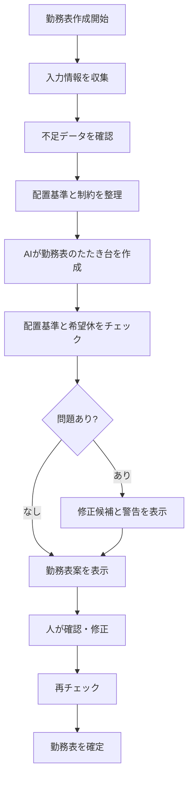

# AI勤務表作成ロジック設計

## 概要

このドキュメントは、保育園向け勤務表管理システムにおける AI 勤務表作成機能の設計をまとめたものです。
AI は勤務表を完全に自動確定するのではなく、職員情報、希望休、クラス、園児数、配置基準などをもとに勤務表のたたき台を作成します。
最終的な確認、修正、確定は人が行います。

## 目的

- 勤務表作成にかかる時間を減らす。
- 希望休や勤務可能時間を考慮した勤務表を作りやすくする。
- 園児数に対する配置基準の不足を見つけやすくする。
- 早番、遅番、延長保育などの負担が特定の職員に偏らないようにする。
- AI作成案を人が確認、修正できる状態で提示する。

## AIに渡す入力情報

### 園情報

| 項目 | 説明 |
| --- | --- |
| 園名 | 対象の保育園名 |
| 開園時間 | 通常保育の開始時間 |
| 閉園時間 | 通常保育の終了時間 |
| 延長保育時間 | 延長保育がある場合の時間帯 |
| 休憩ルール | 勤務時間に応じた休憩時間 |

### 職員情報

| 項目 | 説明 |
| --- | --- |
| 職員名 | 勤務表に表示する職員名 |
| 職種 | 保育士、看護師、調理員、事務など |
| 雇用区分 | 常勤、パート、臨時など |
| 保育士資格 | 配置基準で資格者として数えられるか |
| 勤務可能曜日 | 通常勤務できる曜日 |
| 勤務可能時間 | 通常勤務できる時間帯 |
| 早番可否 | 早番に入れるか |
| 遅番可否 | 遅番に入れるか |
| 延長保育可否 | 延長保育に入れるか |
| 担当可能クラス | 対応できる年齢、クラス |
| 月の上限勤務日数 | 働きすぎを防ぐための上限 |
| 連勤上限 | 連続勤務を避けるための上限 |

### 希望休・勤務希望

| 項目 | 説明 |
| --- | --- |
| 対象年月 | 勤務表を作成する年月 |
| 休みたい日 | 職員が休みを希望する日 |
| 勤務できる日 | 職員が勤務可能な日 |
| 勤務できない時間帯 | 部分的に勤務できない時間帯 |
| 希望する勤務区分 | 早番、日勤、遅番、延長保育など |
| 希望理由 | 管理者が判断するためのメモ |

### クラス・園児情報

| 項目 | 説明 |
| --- | --- |
| クラス名 | 例: 0歳児、1歳児、2歳児 |
| 年齢区分 | 配置基準の判定に使う年齢 |
| 園児数 | クラスごとの園児数 |
| 主担当職員 | 担任、主担当がいる場合 |
| クラスメモ | 配慮が必要な内容など |

### 配置基準

| 項目 | 説明 |
| --- | --- |
| 年齢区分 | 0歳児、1歳児、2歳児など |
| 園児数に対する必要職員数 | 配置基準の計算に使う |
| 最低配置人数 | 園独自の最低人数 |
| 資格者条件 | 保育士資格者として数える必要があるか |
| 時間帯別ルール | 早番、遅番、延長保育の最低人数 |

## AIが守るべき制約

### 必ず守る制約

- 希望休の日には原則として勤務を入れない。
- 勤務可能時間外には勤務を入れない。
- 保育士資格が必要な配置には、資格者を必要数入れる。
- クラスごとの園児数に対して、配置基準を下回らないようにする。
- 早番、遅番、延長保育は対応可能な職員だけに割り当てる。
- 1日の勤務時間が園のルールを超えないようにする。
- 休憩が必要な勤務時間では、休憩時間を確保する。

### できるだけ守る制約

- 早番、遅番、延長保育の回数が職員間で偏りすぎないようにする。
- 連勤が多くなりすぎないようにする。
- 月の勤務日数が職員間で偏りすぎないようにする。
- 主担当職員は可能な範囲で担当クラスに入れる。
- パート職員の勤務時間は登録された希望に近づける。
- 前月までの勤務傾向がある場合は、極端な変化を避ける。

## 優先順位

AI は以下の優先順位で勤務表を作成します。

1. 法令や園の配置基準を満たす。
2. 希望休、勤務不可時間を守る。
3. 保育士資格者が必要な時間帯に配置されている。
4. 早番、遅番、延長保育に対応できる職員を配置する。
5. 職員ごとの勤務日数、連勤、早番、遅番の偏りを減らす。
6. 担当可能クラス、主担当クラスを考慮する。
7. 希望勤務区分や希望時間にできるだけ合わせる。

## AI作成の流れ

## AIの出力内容

AI は以下の情報を出力します。

| 出力 | 説明 |
| --- | --- |
| 月間勤務表案 | 1か月分の職員ごとの勤務割り当て |
| 日別勤務表案 | 日ごとのクラス別、時間帯別の配置 |
| 警告一覧 | 配置不足、希望休との矛盾、勤務偏りなど |
| 調整理由 | なぜその職員を割り当てたかの簡単な理由 |
| 修正候補 | 問題がある場合の入れ替え候補 |
| 集計情報 | 職員ごとの勤務日数、早番回数、遅番回数など |

## 人が確認・修正する内容

- 希望休が守られているか。
- 配置基準を満たしているか。
- 特定の職員に負担が偏っていないか。
- クラスの担当に無理がないか。
- 新人職員や配慮が必要な職員の配置が適切か。
- 園の実情に合わない割り当てがないか。

## 警告の種類

| 警告 | 内容 |
| --- | --- |
| 配置不足 | 必要な職員数を満たしていない |
| 資格者不足 | 保育士資格者が必要数に足りない |
| 希望休違反 | 希望休の日に勤務が入っている |
| 勤務不可時間違反 | 勤務できない時間帯に割り当てられている |
| 連勤過多 | 連続勤務が上限を超えている |
| 勤務偏り | 早番、遅番、勤務日数などが偏っている |
| 担当外クラス | 担当可能クラス以外に配置されている |

## AI作成条件の指定項目

管理者は勤務表作成前に、AIへ以下の条件を指定できるようにします。

| 条件 | 説明 |
| --- | --- |
| 希望休の優先度 | 希望休をどの程度優先するか |
| 公平性の優先度 | 早番、遅番、勤務日数の偏りをどの程度抑えるか |
| 主担当優先 | 担任、主担当をクラスに優先配置するか |
| パート希望優先 | パート職員の希望時間を優先するか |
| 警告許容 | 警告が残っても作成案を出すか |

## 保存する履歴

AI作成案と人の修正内容は、後から確認できるように履歴を残します。

| 履歴 | 説明 |
| --- | --- |
| AI作成日時 | いつAIが作成したか |
| 作成条件 | AIに指定した優先条件 |
| AI作成案 | AIが最初に出した勤務表案 |
| 警告内容 | AI作成時に出た警告 |
| 修正内容 | 人が変更した勤務枠 |
| 確定者 | 最終的に確定したユーザー |
| 確定日時 | 勤務表を確定した日時 |

## 画面との関係

| 画面 | AI機能との関係 |
| --- | --- |
| 勤務表作成画面（月単位） | AI作成条件を指定し、勤務表案を作成する |
| 勤務表確認画面 | AI作成案、人の修正内容、警告を確認する |
| 配置チェック画面 | 配置基準や資格者不足を確認する |
| 1日の勤務表画面 | 日別の配置を確認、修正する |
| 勤務表出力画面 | 確定後の勤務表をCSVや紙で出力する |

## 今後検討する項目

- AIに渡すデータ量をどこまで絞るか。
- AIの提案理由をどの程度表示するか。
- AI作成案の採用率や修正履歴を分析するか。
- 自動作成を一度で完了させるか、日別・週別に分けて調整できるようにするか。
- AIが判断してよい範囲と、人が必ず判断する範囲を明確にする。
- 個人情報をAIに渡す場合の取り扱い。
