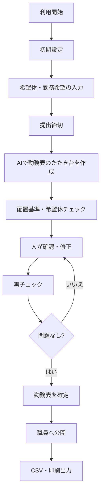
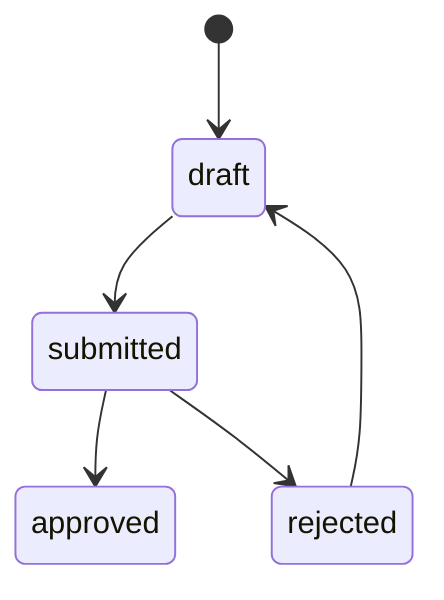
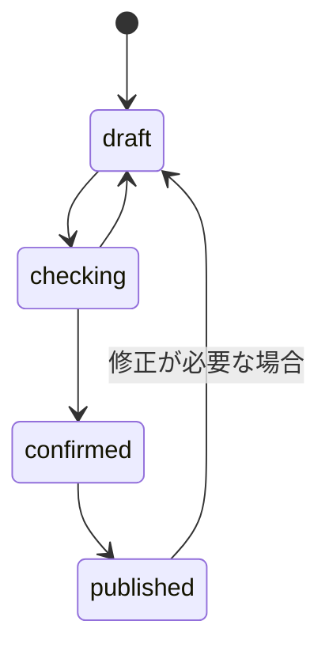

# 業務フロー設計

## 概要

このドキュメントは、保育園向け勤務表管理システムにおける業務の流れを整理したものです。
職員情報やクラス情報の初期設定から、希望休の提出、AIによる勤務表作成、人による確認・修正、確定、公開、出力までの流れを定義します。

## 利用者の役割

| 役割 | 主な操作 |
| --- | --- |
| 管理者 | 園情報、職員、クラス、配置基準、勤務表を管理する |
| 勤務表作成者 | 希望休を確認し、AI作成、修正、確定を行う |
| 職員 | 希望休や勤務希望を入力し、公開された勤務表を確認する |

## 全体フロー

## 1. 初期設定フロー

### 対象者

管理者

### 流れ

1. 園情報を登録する。
2. 開園時間、閉園時間、延長保育時間を設定する。
3. 早番、日勤、遅番、延長保育などの勤務区分を設定する。
4. **勤務表を作る対象月**について、園カレンダーに休園・行事・臨時の開園時間を登録する（[nursery-info.md](./details/nursery/nursery-info.md)）。
5. 職員を登録する。
6. 職員の資格、雇用区分、勤務可能時間、担当可能クラスを登録する。
7. クラスと園児数を登録する。
8. 年齢別の配置基準を設定する。
9. 希望休の提出期限を設定する。

### 完了条件

- 勤務表作成に必要な職員、クラス、配置基準、**対象月の園カレンダー（行事・休園）**が登録されている。
- 希望休を入力できる状態になっている。

## 2. 希望休・勤務希望入力フロー

### 対象者

職員

### 流れ

1. 職員がログインする。
2. 対象年月を選択する。
3. 休みたい日を入力する。
4. 勤務できる日、勤務できる時間帯を入力する。
5. 早番、遅番、延長保育などの希望を入力する。
6. 必要に応じて理由やメモを入力する。
7. 確認画面で入力内容を確認する。
8. 希望休・勤務希望を提出する。

### 完了条件

- 希望休のステータスが `submitted` になる。
- 管理者が希望休を確認できる。

## 3. 希望休確認フロー

### 対象者

管理者、勤務表作成者

### 流れ

1. 対象年月の希望休提出状況を確認する。
2. 未提出の職員を確認する。
3. 必要に応じて職員へ提出を促す。
4. 希望休や勤務希望の内容を確認する。
5. 明らかな入力ミスがあれば職員へ修正を依頼する。
6. 希望休の受付を締め切る。

### 完了条件

- 勤務表作成に使う希望休データが揃っている。
- 未提出者や入力不備が把握できている。

## 4. AI勤務表作成フロー

### 対象者

管理者、勤務表作成者

### 流れ

1. 対象年月を選択する。
2. AI作成に使う情報を確認する。
3. 希望休の優先度、公平性の優先度、主担当優先などの作成条件を指定する。
4. AIが勤務表のたたき台を作成する。
5. AI作成案、警告、調整理由を確認する。
6. 配置不足、資格者不足、希望休違反などの警告を確認する。

### 完了条件

- AIによる勤務表のたたき台が作成されている。
- 修正が必要な箇所が警告として表示されている。

## 5. 人による確認・修正フロー

### 対象者

管理者、勤務表作成者

### 流れ

1. 月間勤務表を確認する。
2. 1日の勤務表でクラス別、時間帯別の配置を確認する。
3. 配置基準チェック結果を確認する。
4. 希望休との矛盾を確認する。
5. 早番、遅番、延長保育の偏りを確認する。
6. 園の実情に合わない割り当てを修正する。
7. 修正後に再度配置チェックを実行する。

### 完了条件

- 配置不足や資格者不足が解消されている。
- 管理者が勤務表の内容を確認済みである。

## 6. 勤務表確定フロー

### 対象者

管理者、勤務表作成者

### 流れ

1. 勤務表確認画面で最終内容を確認する。
2. 警告が残っている場合は内容を確認する。
3. 確定してよい場合、勤務表を確定する。
4. 勤務表ステータスを `confirmed` にする。
5. 確定日時と確定者を記録する。

### 完了条件

- 勤務表が確定済みになっている。
- 確定後の勤務表が公開準備できている。

## 7. 勤務表公開フロー

### 対象者

管理者、勤務表作成者、職員

### 流れ

1. 管理者が公開操作を行う。
2. 勤務表ステータスを `published` にする。
3. 職員が自分の勤務表を確認できるようにする。
4. 必要に応じて通知を送る。

### 完了条件

- 職員が公開済みの勤務表を確認できる。
- 管理者が公開状況を確認できる。

## 8. CSV・印刷出力フロー

### 対象者

管理者、勤務表作成者

### 流れ

1. 出力対象の年月または日付を選択する。
2. 出力形式を選択する。
3. 職員向け、管理者向け、掲示用などのレイアウトを選択する。
4. CSVエクスポートまたは印刷用表示を行う。
5. 印刷前の表示を確認する。
6. 必要に応じて紙に印刷する。

### 完了条件

- 勤務表がCSVまたは紙で出力できている。
- 出力履歴が記録されている。

## 例外フロー

### 希望休が未提出の職員がいる場合

- 未提出者を一覧で表示する。
- 管理者が代理入力するか、未提出のままAI作成に進むかを選択する。
- 未提出の職員は、AI作成時に通常の勤務可能条件をもとに割り当てる。

### 配置基準を満たせない場合

- 不足している日、時間帯、クラスを表示する。
- 足りない職員数と資格者数を表示する。
- 入れ替え候補や追加勤務候補を表示する。
- 管理者が手動で修正する。

### 確定後に修正が必要になった場合

- 確定済み勤務表を修正可能状態に戻す。
- 修正理由を入力する。
- 修正後に再度配置チェックを行う。
- 再確定し、必要に応じて職員へ通知する。

## ステータス遷移

### 希望休

### 勤務表

## 今後検討する項目

- 希望休の承認を必須にするか。
- AI作成前に未提出者をどこまで厳しく扱うか。
- 確定後の修正権限を誰に持たせるか。
- 職員への通知方法をメール、アプリ内通知、LINE連携などから選ぶか。
- 印刷後に修正された場合の差分通知をどう扱うか。
