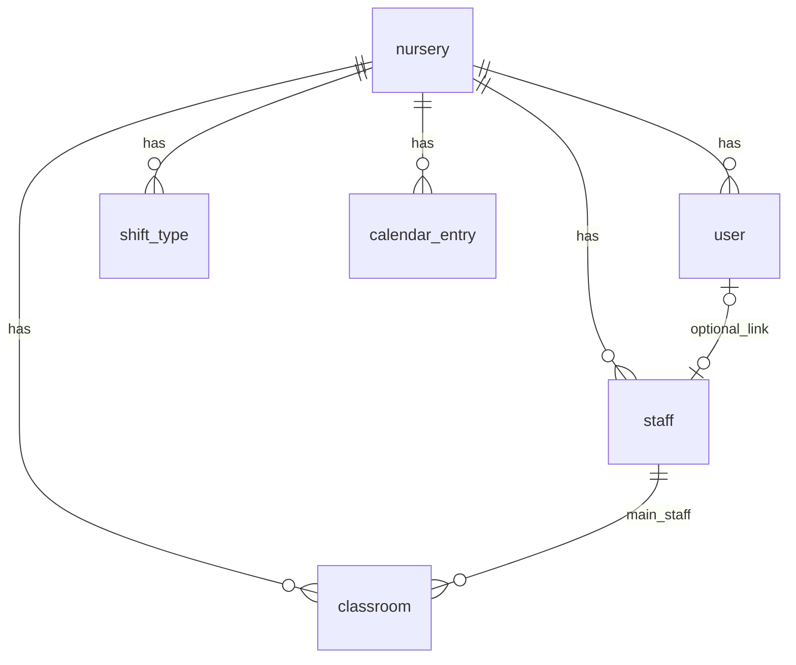
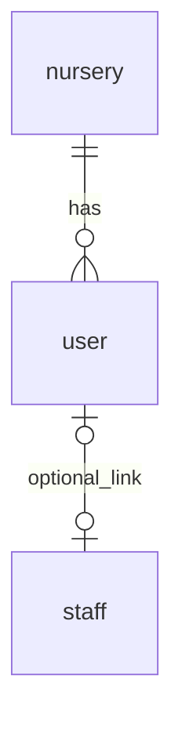
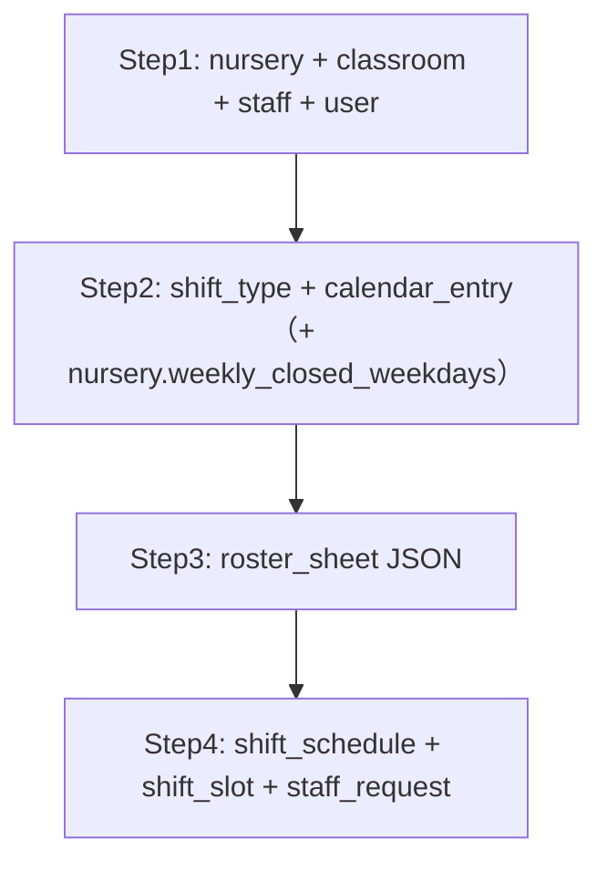

# DB構造（全体像）

このドキュメントは、アプリ全体の **PostgreSQL データベース構造** を俯瞰するための資料です。  
テーブル定義の詳細は [data-design.md](./data-design.md) を参照してください。

## `nursery` とは何か（用語の整理）

| 言い方 | 正しいか | 実際の意味 |
| --- | --- | --- |
| 園のデータベース | やや誤解を招く | PostgreSQL 全体は **1つ**（例: `shiftmanager`） |
| `nursery` テーブル | 正しい | **保育園1施設 = 1行** のマスタ表 |
| 園のデータ | 口語としてOK | `nursery` 行 + それにぶら下がる `classroom` / `staff` など |

```text
PostgreSQL データベース「shiftmanager」  ← アプリ全体で1つ
  └── テーブル nursery（園マスタ）        ← 星の子保育園 = 1レコード
  └── テーブル classroom（クラス）      ← nursery_id で「どの園か」を指定
  └── テーブル staff（職員）
  └── テーブル user（ログイン）
  └── …
```

- MVPでは **園は1件だけ** 入れる想定（`nursery` に1行）
- 将来、複数園を扱うときも **DBは増やさず** `nursery` に行を増やす

## 全体像

- **DBは1つ**（PostgreSQL `shiftmanager`）
- **別DBに分けない**（園管理者用 / 運営者用 は同じDB内のテーブルと `role` で区別）
- **親は `nursery`（園）**。クラス・職員・ユーザー・勤務表などはすべて `nursery_id` で紐づく



---

## レイヤー別のテーブル一覧

### 1. 園マスタ（園管理 `/nursery`）

| テーブル | 役割 | 主な画面 |
| --- | --- | --- |
| `nursery` | 園名・開閉園時間・定休曜日（`weekly_closed_weekdays`）など | `/nursery/settings` |
| `shift_type` | 勤務区分（早番/日勤/遅番など） | `/nursery/settings` |
| `calendar_entry` | 休園・行事・臨時開園（**休日設定と行事カレンダーで共有**） | `/nursery/settings`（休園）・`/nursery/calendar` |
| `classroom` | クラス名・年齢区分・登録園児数 | `/nursery/classes` |
| `staff` | 職員マスタ | `/nursery/staff` |

※ `staff.capable_class_ids`（`String[]`）で「職員が担当可能なクラス」を管理します（結合テーブルは未作成）。

**ポイント:** `classroom.main_staff_id` → `staff.id`（主担当）。詳細は [data-design.md](./data-design.md) に定義。

---

### 2. 認証・権限（ログイン）

| テーブル | 役割 |
| --- | --- |
| `user` | ログインアカウント（`email` or 職員ID）、`password_hash`、`role` |



| role | 意味 | 例 |
| --- | --- | --- |
| `admin` | 園管理者 | 園情報・クラス・職員を編集 |
| `manager` | 勤務表作成者 | 勤務表・体制表を作成 |
| `staff` | 職員 | 希望休入力・公開済み勤務表閲覧 |

- **園管理者専用の別DBは不要**。`user` 行 + `role = admin` + `nursery_id`
- **管理者を追加する管理画面**は未実装でも、**`user` テーブル自体は必要**（seedで最初の1人を入れる）

---

### 3. 勤務表（月次 `/shifts`）

| テーブル | 役割 |
| --- | --- |
| `shift_schedule` | 月単位の勤務表ヘッダ（`target_month`, `status`） |
| `shift_slot` | 1日×1職員の勤務内容（区分・時間・クラス） |
| `staff_request` | 希望休・勤務希望 |
| `staffing_check_result` | 配置チェック結果（将来） |
| `export_history` | CSV/印刷履歴 |

※現状、このリポジトリでは `shift_schedule` 等は Prisma のテーブルとしては未作成で、勤務表作成はモック（`src/lib/mock-shift-schedule.ts`）で動作しています。

**一意制約の想定:** `shift_schedule` は `(nursery_id, target_month)` で1件。

---

### 4. 体制表（日次 `/roster`）

現状は Prisma のテーブル未作成で、画面 [details/roster.md](./details/roster.md) と実装では JSONファイルで日次保存しています。

**MVPの保存形（おすすめ）:**

| テーブル | 役割 |
| --- | --- |
| `roster_sheet` | 1日1園の体制表（`date_key`, `payload` JSON） |

`payload` に含めるもの（現行UIと一致）:

- 行構成（スケジュール行 / 備考行）
- クラス×時間×職員配置
- 当日園児数（クラス別）
- 列幅・行高（UI状態）

**一意制約:** `(nursery_id, date_key)`

**将来:** 正規化して `roster_row`, `roster_assignment`, `roster_note` などに分割可能。

---

## 現状（コード）との差

| 領域 | 設計 | 実装 |
| --- | --- | --- |
| 園・クラス・職員・勤務区分 | DB接続済み | Prisma + API |
| 休日・カレンダー | `calendar_entry` + 定休曜日 | **DB接続済み**（`/api/nursery/holiday-settings`） |
| ログイン | `user` テーブル | **モック**（`mock-auth.ts`, `?role=`） |
| 勤務表 | `shift_schedule` 等 | **モック** |
| 体制表 | `roster_sheet` 想定 | **JSONファイル** `src/app/api/roster/route.ts` → `data/roster-store.json` |
| Prisma / PostgreSQL | 導入済み | `calendar_entry` はマイグレーション追加済み（API実装あり） |

PostgreSQL本体はローカル起動済み（`shiftmanager` DB作成済み）。

---

## MVPで最初に作るテーブル（推奨順）



1. **Step 1** — 園管理の土台（編集画面が既にある）
2. **Step 2** — 園設定・カレンダー（既存UIをDB接続）
3. **Step 3** — 体制表（いまの `/api/roster` を DB の `roster_sheet` に置換）
4. **Step 4** — 勤務表・希望休

---

## 1園MVPの最小データ例

```text
nursery          … 1件（星の子保育園）
user             … admin 1人 + 必要なら staff/manager
classroom        … 0歳〜5歳クラス数件
staff            … 職員数件
shift_type       … 早/日/遅/延
roster_sheet     … 日付ごと（編集した日だけ）
```

---

## 将来（今は不要）

- **運営者（operator）** — 複数園横断管理（[management.md](./details/nursery/management.md) に「将来」と記載）
- 園児数の履歴テーブル
- 体制表の完全正規化

---

## まとめ

| 質問 | 答え |
| --- | --- |
| DBはいくつ？ | **1つの PostgreSQL** |
| 中心テーブルは？ | **`nursery`（園）** |
| 園管理者は別DB？ | **いいえ**。`user` + `role=admin` |
| 体制表は？ | **`roster_sheet`（日次、最初はJSON列）** |
| 今どこまで？ | 体制表のみ **JSONファイル保存**。Prisma未導入 |

---

## 関連

- [data-design.md](./data-design.md) — テーブル項目の詳細定義
- [details/nursery/holiday-and-calendar-data.md](./details/nursery/holiday-and-calendar-data.md) — 休日・カレンダー統合方針
- [permission-design.md](./permission-design.md) — 役割と操作権限
- [details/roster.md](./details/roster.md) — 体制表画面設計
