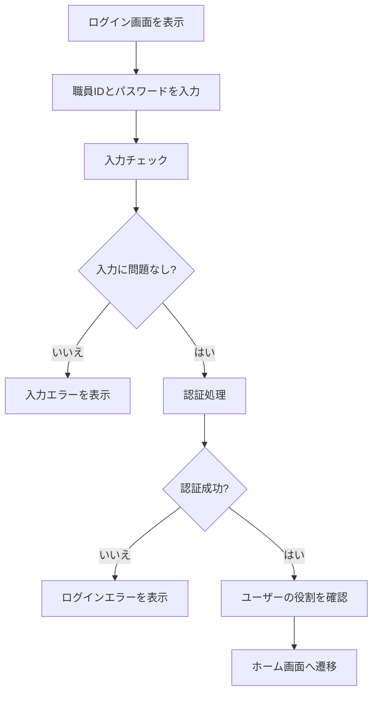
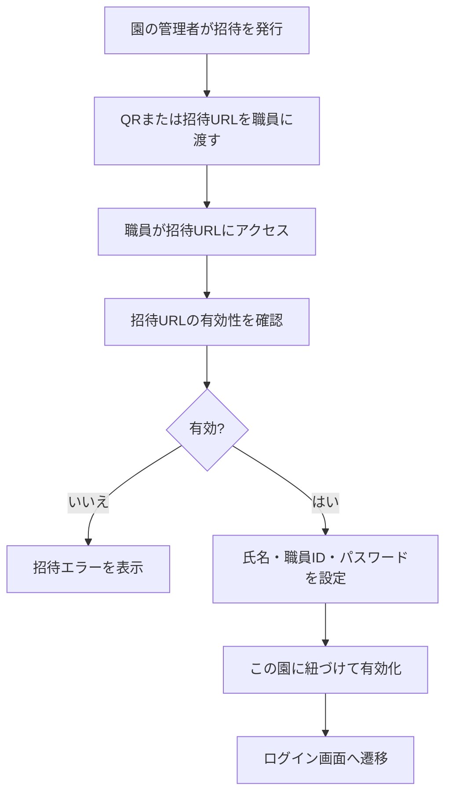

# ログイン画面 詳細設計

## 概要

このドキュメントは、保育園向け勤務表管理システムのログイン画面に関する詳細設計をまとめたものです。
ログイン画面は、管理者、勤務表作成者、職員がシステムを利用するための入口です。

## 目的

- 登録済みユーザーだけがシステムを利用できるようにする。
- ログイン後、ユーザーの役割に応じた画面を表示する。
- 不正ログインや誤入力に対して適切なエラーを表示する。
- 複数の園が利用する前提でも、園コードを入力せずにログインできるようにする。

## 決定事項

- ログイン時に園コードは入力させない。
- 職員アカウントは、園の管理者が職員登録後に招待する。
- 招待方法は QR 招待と招待 URL（LINE 等で共有）を想定する。システムからのメール送信は行わない。
- 招待URLに園と職員の紐づけ情報を持たせる。
- 職員は招待URLから初回パスワードを設定する。
- **職員のログインは職員ID + パスワード**（メールアドレスは使わない）。
- 職員IDは招待QR経由の初回登録で本人が設定する（園内で一意）。
- QR / 招待URL は**自分の端末で使う職員**向け。トークンに園IDを含め、この園用アカウントの初回登録に使う。
- 園の共有端末のみの職員は、個人用 QR の配布は不要（園タブレットで初回登録を手伝う等）。
- 登録後は **端末を問わない**。希望休入力・パスワード変更などは園タブレットから同じ職員IDで可能。
- MVP のログイン画面は開発用にメール入力のモックのまま。本番の職員向けは職員ID入力に差し替える。
- MVPでは `1ユーザー = 1園所属` を前提にする。

## 対象ユーザー

| 役割 | ログイン後の主な利用目的 |
| --- | --- |
| 管理者 | 園情報、職員、クラス、配置基準、勤務表を管理する |
| 勤務表作成者 | 希望休の確認、AI勤務表作成、修正、確定、公開を行う |
| 職員 | 希望休を入力し、公開された勤務表を確認する |

## 画面項目

| 項目 | 種別 | 必須 | 説明 |
| --- | --- | --- | --- |
| 職員ID | input | yes | ログインに使用する職員ID（メール不要） |
| パスワード | password | yes | ログインに使用するパスワード |
| ログインボタン | button | yes | 入力内容でログインを実行する |
| パスワードを忘れた場合 | link | no | パスワード再設定画面への導線 |
| エラーメッセージ | text | no | ログイン失敗時の理由を表示する |

園コードはログイン画面には表示しない。
園との紐づけは、招待URLまたはユーザー情報に紐づく園IDで判定する。

## 画面レイアウト

```text
--------------------------------------------------
|                                                |
|                 サービス名                      |
|          保育園向け勤務表管理システム             |
|                                                |
|  職員ID                                        |
|  [ 1                                      ]     |
|                                                |
|  パスワード                                     |
|  [ ********                              ]      |
|                                                |
|  [ ログイン ]                                  |
|                                                |
|  パスワードを忘れた場合                         |
|                                                |
--------------------------------------------------
```

## 入力バリデーション

| 項目 | 条件 | エラーメッセージ |
| --- | --- | --- |
| 職員ID | 未入力 | 職員IDを入力してください。 |
| 職員ID | 形式不正 | 職員IDの形式が正しくありません。 |
| パスワード | 未入力 | パスワードを入力してください。 |

## ログイン失敗時のエラー

| 状況 | 表示メッセージ |
| --- | --- |
| 職員IDまたはパスワードが違う | 職員IDまたはパスワードが正しくありません。 |
| ユーザーが無効 | このアカウントは利用できません。管理者に確認してください。 |
| 通信エラー | 通信に失敗しました。時間をおいて再度お試しください。 |
| 一時的なサーバーエラー | ログインできませんでした。時間をおいて再度お試しください。 |

セキュリティ上、職員IDが存在するかどうかは明示しない。

## ログイン処理フロー



## 招待・初回パスワード設定フロー



## 招待方法

| 招待方法 | 用途 | 説明 |
| --- | --- | --- |
| QR招待 | 現場での案内（主） | 管理者がQRを印刷または表示し、職員が読み取って初回登録する |
| 招待URL | 遠隔共有 | 管理者がURLをコピーし、LINE 等で送る。メール送信機能は持たない |

QR招待は職員ごとの個別招待URLを発行する。
共通QRを掲示する方式は、誰が登録したかの管理が難しくなるため初期案では採用しない。

## 初回パスワード設定画面

| 項目 | 種別 | 必須 | 説明 |
| --- | --- | --- | --- |
| 職員名 | text | no | 招待対象の職員名を確認用に表示する |
| 園名 | text | no | 招待元の園名を確認用に表示する |
| 職員ID | text | yes | 初回登録で本人が設定（1からの数字・園内で一意） |
| パスワード | password | yes | 初回設定するパスワード |
| パスワード確認 | password | yes | 入力間違い防止の確認 |
| 設定ボタン | button | yes | パスワードを設定してアカウントを有効化する |

### 初回パスワード設定のバリデーション

| 項目 | 条件 | エラーメッセージ |
| --- | --- | --- |
| パスワード | 未入力 | パスワードを入力してください。 |
| パスワード | 最低文字数を満たさない | パスワードは8文字以上で入力してください。 |
| パスワード確認 | パスワードと一致しない | パスワードが一致しません。 |

## 招待URLの制約

- 招待URLには有効期限を設定する。
- 招待URLは原則1回のみ利用できる。
- 招待URLには園IDと職員IDを直接表示せず、推測しにくいトークンを使用する。
- パスワード設定後、招待URLは無効化する。
- 期限切れの場合は、管理者に再招待を依頼するメッセージを表示する。

## ログイン後の遷移

| 役割 | 遷移先（本番想定） | 遷移先（現在の UI 確認用） | 表示内容 |
| --- | --- | --- | --- |
| 管理者 | `/home` | `/home?role=admin` | 本日の予定、勤務表作成・体制表作成・園管理への導線 |
| 勤務表作成者 | `/home` | `/home?role=manager` | 希望休、勤務表作成、配置チェックへの導線（仮表示） |
| 職員 | `/home` | `/home?role=staff` | 希望休入力、公開済み勤務表への導線（仮表示） |

ログイン後の遷移先は共通でホーム画面とし、表示内容を役割ごとに切り替える。

現在のフロント実装では、ダミー認証成功時に `role` クエリ付きで `/home` へ遷移する。ルート `/` は `/login` へリダイレクトする。

ホーム画面のレイアウト・要素の詳細は `docs/details/home-screen-design.md` を参照する。

## セッション管理

- ログイン成功時にセッションを作成する。
- セッションにはユーザーID、園ID、役割を紐づける。
- 一定時間操作がない場合は自動ログアウトする。
- ログアウト時はセッションを破棄する。
- MVPでは1ユーザーが1園に所属する前提とし、ログイン後の園選択画面は作らない。
- 将来的に1ユーザーが複数園に所属する場合は、ログイン後に園選択画面を追加する。

## セキュリティ方針

- パスワードは平文で保存しない。
- ログイン失敗時に、メールアドレスの存在有無を推測できる表示をしない。
- 一定回数ログインに失敗した場合の制限を検討する。
- HTTPSで通信する。
- 職員はログイン後も自分に許可された情報のみ閲覧できる。
- 招待URLのトークンは推測できない文字列にする。
- 招待URLの有効期限切れ、使用済み、無効化済みを判定する。

## 権限との関係

ログイン後は、ユーザーの `role` に応じて画面や操作を制御する。

| role | 役割 |
| --- | --- |
| admin | 管理者 |
| manager | 勤務表作成者 |
| staff | 職員 |

## 今後検討する項目

- パスワード再設定画面を作るか。
- パスワード再設定をメールで行うか。
- 二段階認証を導入するか。
- ログイン失敗回数によるロックを導入するか。
- 複数園に所属するユーザー向けの園選択画面を作るか。
