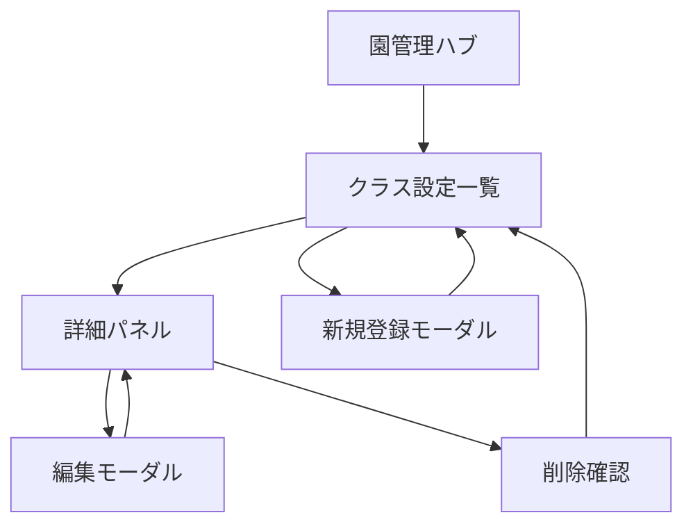

# クラス管理 詳細設計

## 概要

このドキュメントは、園管理配下の**クラス管理**（クラス一覧）に関する詳細設計をまとめたものです。
配置基準は**体制表作成**側で設定する（園管理のクラス管理には含めない）。
管理者が、園内のクラス（0歳児クラス、1歳児クラスなど）を**一覧表示**し、**登録・編集・削除**できるようにします。

園管理ハブの概要は [management.md](./management.md) を参照。

## 画面情報

| 項目 | 内容 |
| --- | --- |
| 画面名 | クラス管理（クラス一覧） |
| パス | `/nursery/classes` |
| 実装ファイル（予定） | `src/app/nursery/classes/page.tsx` |
| 親画面 | 園管理ハブ `/nursery` |
| 対象役割 | 管理者（編集）。勤務表作成者（閲覧のみ・将来） |
| 認証 | 未接続（ダミー認証で `?role=admin` を付与） |

## 目的

- 勤務表・配置基準・体制表作成に必要な「クラス」と「園児数」を園ごとに管理する。
- クラス単位の情報を一覧で把握し、必要に応じてすぐ追加・修正できるようにする。
- 誤削除を防ぎつつ、不要になったクラスを整理できるようにする。

## スコープ

### 含む（MVP）

- クラス一覧の表示
- クラスの新規登録
- クラスの編集
- クラスの削除（確認ダイアログ付き）
- 園管理ハブへの戻り導線

### 含まない（別画面・将来）

- クラスごとの日別園児数の履歴管理
- 主担当職員の勤務表への自動反映
- CSV インポート・エクスポート
- クラス順のドラッグ並び替え（将来検討）

## 権限

`docs/permission-design.md` に準拠する。

| 操作 | 管理者 | 勤務表作成者 | 職員 |
| --- | --- | --- | --- |
| クラス一覧の閲覧 | yes | view | no |
| クラスの登録 | yes | no | no |
| クラスの編集 | yes | no | no |
| クラスの削除 | yes | no | no |

MVP の UI 実装フェーズでは、管理者（`role=admin`）のみを対象とする。

## データ項目

`docs/data-design.md` の「クラス」テーブルに対応する。

| 項目 | 画面ラベル | 必須 | 一覧表示 | 登録・編集 | 備考 |
| --- | --- | --- | --- | --- | --- |
| name | クラス名 | yes | yes | yes | 例: ひまわり組、0歳児クラス |
| age_group | 年齢区分 | yes | yes | yes | 選択式（下表） |
| child_count | 園児数 | yes | yes | yes | 0以上の整数 |
| auxiliary_slots | 補助の人数・時間 | no | no | yes | 複数行可。人数＋開始・終了時間（候補または入力）。人数欄左の＋（丸ボタン）で追加 |
| main_staff_id | 主担任 | no | yes | yes | **1名のみ**。一覧・詳細・編集で表示 |
| other_staff_ids | 担任 | no | no | yes | 主担任以外の担任。一覧には表示しない |
| note | 補足メモ | no | no | yes | 詳細画面・登録・編集で表示 |

### 年齢区分（age_group）

| 値 | 表示名 |
| --- | --- |
| age_0 | 0歳児 |
| age_1 | 1歳児 |
| age_2 | 2歳児 |
| age_3 | 3歳児 |
| age_4 | 4歳児 |
| age_5 | 5歳児 |
| mixed | 混合 |

## 画面構成

一覧画面を中心とし、クラス名クリックで**詳細パネル**を開く。登録・編集はモーダル、削除は詳細から起動する確認ダイアログとする。



## レイアウト

一覧画面の DOM・スクロール・ツールバーは **[list-screen-layout.md](./list-screen-layout.md)** に準拠する（職員管理と同一パターン）。

```text
+------------------------------------------------------------------+
| サイドバー          |  パンくず                                  |
|                     |  +--------------------------------------+ |
|                     |  | AppHeader: クラス管理      [管理者]  | |  ← 固定カード
|                     |  +--------------------------------------+ |
|                     |  +--------------------------------------+ |
|                     |  | クラス数：4件      [クラスを追加]    | |  ← 一覧パネル（別カード）
|                     |  | クラス名 | 年齢区分 | 園児数 | 主担任 | |
|                     |  | (スクロール領域)                       | |
|                     |  +--------------------------------------+ |
+------------------------------------------------------------------+
```

### ヘッダー（`page.tsx`）

| 要素 | 内容 |
| --- | --- |
| パンくず | 園管理 > クラス管理（園管理は `/nursery` へリンク） |
| eyebrow | 園管理 |
| タイトル | クラス管理 |
| 説明 | クラス・園児数・担当職員を管理します。配置基準は体制表作成で設定します。 |
| 右上チップ | 管理者（既存と同様） |

### 一覧パネル（`classes-settings.tsx`）

| 要素 | 内容 |
| --- | --- |
| 件数 | 左: **クラス数：○件** |
| 主操作 | 右: **クラスを追加** |

### 一覧テーブル

| 列 | 内容 | 備考 |
| --- | --- | --- |
| クラス名 | name | リンク風ボタン。クリックで詳細パネルを開く |
| 年齢区分 | age_group の表示名 | |
| 園児数 | child_count | 右寄せ、`○○名` |
| 主担任 | 主担当職員名 | 未設定時は「未設定」 |

担任は一覧に表示しない。

- デフォルトの並び順: 年齢区分の昇順 → クラス名のあいうえお順
- 0件時: 空状態メッセージと「クラスを追加」ボタン

### 詳細パネル（クラス名クリック時）

モーダル内で情報をカード状に区切って表示する（装飾は控えめ）。

| 要素 | 内容 |
| --- | --- |
| ヘッダー | 年齢区分バッジ + クラス名（薄いグレー背景） |
| サマリー | 年齢区分・園児数 |
| 担当職員 | 主担任・担任・補助の人数（時間付き） |
| 担任 | 複数時はタグ表示 |
| 補足メモ | 登録がある場合のみ、別ブロック |
| 操作 | **編集する**（青）/ **削除**（赤枠） |

### 空状態

| 要素 | 文案例 |
| --- | --- |
| 見出し | クラスがまだ登録されていません |
| 説明 | クラスを追加すると、勤務表・体制表作成で利用できます。 |
| 操作 | クラスを追加 |

## 登録・編集

### 表示方式

- **モーダル**でフォームを表示する（一覧を見たまま操作できるため）。
- タイトル: 新規登録時「クラスを追加」、編集時「クラスを編集」。

### フォーム項目

| 項目 | 種別 | 必須 | バリデーション |
| --- | --- | --- | --- |
| クラス名 | text | yes | 1文字以上50文字以内。前後空白はトリム |
| 年齢区分 | select | yes | 定義済み enum のいずれか |
| 園児数 | number | yes | 0以上999以下の整数 |
| 主担任 | コンボボックス（**1名のみ**・文字検索） | no | 在籍中職員から1名。未選択可 |
| 担任 | コンボボックス（複数選択・文字検索） | no | 名前で絞り込み。主担任以外から選択 |
| 補助の人数 | 人数 + 開始・終了時間（複数行） | no | 担任の下。候補選択または H:MM 入力。人数欄左の＋（丸ボタン）で時間帯を追加 |
| 補足メモ | textarea | no | 500文字以内 |

### ボタン

| ボタン | 動作 |
| --- | --- |
| キャンセル | モーダルを閉じ、入力内容を破棄 |
| 保存 | バリデーション後に登録または更新し、一覧を更新してモーダルを閉じる |

### 編集の起動

- 詳細パネルの「編集」から、対象クラスの値をフォームにプリセットしてモーダルを開く。

## 削除

### フロー

1. 詳細パネルの「削除」を押す。
2. 確認ダイアログを表示する。
3. 「削除する」で確定、「キャンセル」で中止。

### 確認ダイアログ

| 要素 | 内容 |
| --- | --- |
| タイトル | クラスを削除しますか？ |
| 本文 | 「{クラス名}」を削除します。この操作は取り消せません。 |
| 注意（将来） | 勤務表・配置で参照中のクラスは削除不可とするルールを後から追加 |

MVP（ダミーデータ）では、参照チェックなしで削除可能とする。

## バリデーション・エラー表示

| 条件 | 表示 |
| --- | --- |
| クラス名が空 | クラス名を入力してください。 |
| クラス名が重複（同一園内） | 同じクラス名が既に登録されています。 |
| 年齢区分が未選択 | 年齢区分を選択してください。 |
| 園児数が未入力・不正 | 園児数は0以上の数値で入力してください。 |
| 保存失敗（将来API） | 保存に失敗しました。時間をおいて再度お試しください。 |

エラーはフィールド直下に表示し、モーダル上部にまとめて表示してもよい。

## ナビゲーション

| 導線 | 遷移先 |
| --- | --- |
| 園管理ハブの「クラス設定」カード | `/nursery/classes?role=admin` |
| パンくず「園管理」 | `/nursery?role=admin` |
| サイドバー「園管理」 | `/nursery?role=admin`（一覧から離れる） |

## ダミーデータ（UI 確認用）

MVP 実装時は `src/lib/mock-classes.ts` などに保持する。

| クラス名 | 年齢区分 | 園児数 | 主担当 |
| --- | --- | --- | --- |
| 0歳児クラス | 0歳児 | 8 | 未設定 |
| 1歳児クラス | 1歳児 | 12 | 未設定 |
| 2歳児クラス | 2歳児 | 15 | 未設定 |
| 3・4・5歳児クラス | 混合 | 18 | 未設定 |

## 実装フェーズ

| フェーズ | 内容 |
| --- | --- |
| 1 | 詳細設計（本ドキュメント） — 完了 |
| 2 | 一覧 UI + ダミーデータ表示 — 完了 |
| 3 | 登録・編集モーダル（クライアント状態で一覧更新） — 完了 |
| 4 | 削除確認 + 一覧からの削除 — 完了 |
| 5 | API / DB 接続（将来） |

## 関連コンポーネント・ファイル

| 種別 | パス |
| --- | --- |
| ページ | `src/app/nursery/classes/page.tsx` |
| 画面本体 | `src/components/classes/classes-settings.tsx` |
| 詳細パネル | `src/components/classes/class-detail-panel.tsx` |
| フォームモーダル | `src/components/classes/class-form-modal.tsx` |
| 職員ダミー | `src/lib/mock-staff.ts` |
| 削除確認 | `src/components/classes/class-delete-dialog.tsx` |
| ダミーデータ | `src/lib/mock-classes.ts` |
| レイアウト | `src/components/layout/admin-shell.tsx` |

## 関連ドキュメント

- [README.md](./README.md) — 園管理配下の設計一覧
- [management.md](./management.md) — 園管理ハブ
- `docs/data-design.md`
- `docs/permission-design.md`
- `docs/screen-structure.md`
