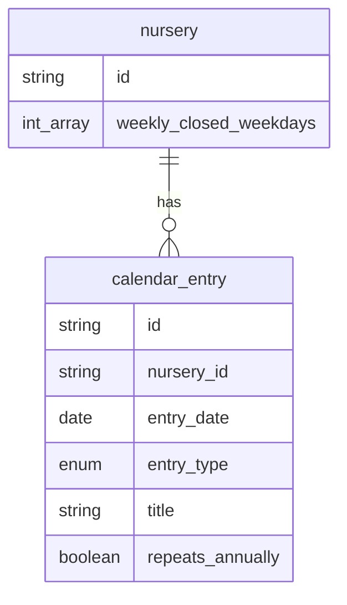

# 休日設定・行事カレンダー — データ設計（統合方針）

## 方針

**休園・祝日・臨時休園は `calendar_entry` に集約**し、**毎週の定休曜日だけ `nursery` に持つ**。

`nursery_closed_day` テーブルは**作らない**（休日設定画面と行事カレンダーで同じデータを二重管理しない）。

| 保存先 | 内容 | 主な画面 |
| --- | --- | --- |
| `nursery.weekly_closed_weekdays` | 毎週休園の曜日（0=日 … 6=土） | 基本設定 › 休日設定 |
| `nursery.close_on_public_holidays` | 国民の祝日を休園とする（トグル「祝」） | 同上 |
| `calendar_entry` | 臨時休園・創立記念日など日付指定の休園 | 休日設定（`closure`）・行事カレンダー（全種別） |

## ER（抜粋）

## `calendar_entry`

| 項目 | 型 | 必須 | 説明 |
| --- | --- | --- | --- |
| id | string | yes | |
| nursery_id | string | yes | |
| entry_date | date | yes | 対象日（`YYYY-MM-DD`） |
| entry_type | enum | yes | `closure` \| `special_hours` \| `event` |
| title | string | yes | 表示名（休園は「元日」など） |
| repeats_annually | boolean | yes | **休園用**。毎年同じ月日（例: 元日）。default false |
| start_time | time | no | `event` の開始 |
| end_time | time | no | `event` の終了 |
| open_time | time | no | `special_hours` の開園 |
| close_time | time | no | `special_hours` の閉園 |
| extended_close_time | time | no | `special_hours` の延長終了 |
| note | string | no | メモ |
| created_at / updated_at | datetime | yes | |

### entry_type ごとの利用

| entry_type | 休日設定 | 行事カレンダー | 勤務表への影響 |
| --- | --- | --- | --- |
| `closure` | ○ 登録・編集 | ○ 表示・編集可 | その日は休園（割当対象外） |
| `special_hours` | — | ○ | 開園時間を上書き |
| `event` | — | ○ | 参考情報（将来ホーム表示など） |

## `nursery.weekly_closed_weekdays`

- PostgreSQL `INTEGER[]`（Prisma: `Int[]`）
- 値は `0`（日）〜 `6`（土）
- 例: `[0]` → 毎週日曜休園
- **日付レコードは増やさない**（ルールとして保持）

## 画面と API（実装状況）

### 休日設定（`/nursery/settings`）

| 操作 | API（実装/案） | 永続先 |
| --- | --- | --- |
| 定休曜日の保存 | 現状は `PATCH /api/nursery/holiday-settings`（予定と同一） | `nursery.weekly_closed_weekdays` |
| 祝日・臨時休園の CRUD | `GET/POST/PATCH/DELETE /api/calendar-entries`（`entry_type=closure` フィルタ） | `calendar_entry` |

フロントの `NurseryRestSettings` / `NurseryClosedDay` は、上記をまとめた**表示用DTO**として維持してよい。

### 行事カレンダー（`/nursery/calendar`）

| 操作 | API（案） |
| --- | --- |
| 月範囲の取得 | `GET /api/calendar-entries?from=&to=` |
| 追加・更新・削除 | 同一リソースの POST / PATCH / DELETE |

## 勤務表・体制表での判定（参照順）

ある `date_key` について:

1. `calendar_entry` に `special_hours` があれば → その開園・閉園・延長を採用
2. そうでなければ `nursery` の通常保育時間
3. 休園かどうか:
   - `weekly_closed_weekdays` に曜日が含まれる、または
   - `calendar_entry` に `closure` があり、（`repeats_annually` の場合は月日一致で展開判定）

`repeats_annually` の展開ロジックはアプリ層で実装（DBに無限行を作らない）。

## 廃止した設計

| 旧案 | 理由 |
| --- | --- |
| `nursery_closed_day` テーブル | `calendar_entry`（`closure`）と重複し、勤務表の参照が二系統になる |

## 関連

- [db-structure.md](../../db-structure.md)
- [data-design.md](../../data-design.md)
- [nursery-settings.md](./nursery-settings.md)
- [nursery-calendar.md](./nursery-calendar.md)
