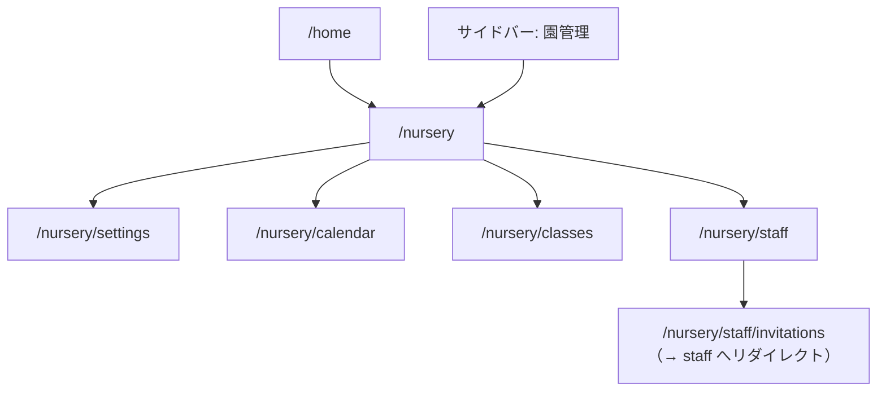

# 園管理ハブ 詳細設計

## 概要

このドキュメントは、保育園向け勤務表管理システムの**園管理ハブ**に関する詳細設計をまとめたものです。
園管理は、1園のマスタデータと運用設定をまとめる入口であり、勤務表作成の前提となる情報を整える領域です。

園配下の各画面設計は `docs/details/nursery/` ディレクトリに配置する。

## 画面情報

| 項目 | 内容 |
| --- | --- |
| 画面名 | 園管理（ハブ） |
| パス | `/nursery` |
| 実装ファイル | `src/app/nursery/page.tsx` |
| 対象役割 | 管理者（MVP）。勤務表作成者は将来、閲覧のみを検討 |
| 認証 | 未接続（ダミー認証で `?role=admin` を付与） |

## 目的

- 園情報、クラス、配置基準、職員、招待など、園の土台データへアクセスする。
- 初期設定フロー（`docs/business-flow.md`）に沿って、設定の推奨順序をユーザーに示す。
- TOP 画面・サイドバーから一貫した導線で園管理へ遷移できるようにする。

## スコープ

### 含む

| 機能 | パス | 設計ドキュメント |
| --- | --- | --- |
| 園管理ハブ | `/nursery` | 本ドキュメント |
| 園情報・勤務区分（設定） | `/nursery/settings` | [nursery-settings.md](./nursery-settings.md) |
| 行事カレンダー | `/nursery/calendar` | [nursery-calendar.md](./nursery-calendar.md) |
| クラス管理 | `/nursery/classes` | [classes.md](./classes.md) |
| 職員管理 | `/nursery/staff` | [staff-management.md](./staff-management.md) |

### 含まない

- 勤務表作成、体制表作成（TOP・サイドバーの別メニュー）
- 希望休の入力・確認（職員・勤務表作成者向け）
- 運営者（operator）による複数園横断管理（将来）

## 権限

`docs/permission-design.md` に準拠する。

| 操作 | 管理者 | 勤務表作成者 | 職員 |
| --- | --- | --- | --- |
| 園管理ハブの閲覧 | yes | 将来検討 | no |
| 園情報の編集 | edit | view | no |
| クラス管理の編集 | edit | no | no |
| 職員登録・編集 | edit | no | no |
| 招待の発行（職員管理内） | edit | no | no |
| ユーザー権限の変更 | edit | no | no |

MVP では管理者のみが園管理にアクセスする前提とする。

## 画面構成

## 園管理ハブ

### レイアウト

- 共通: 左サイドバー + メイン（`AdminShell`）
- ヘッダー: eyebrow `園管理`、title 園名（ダミー: 星の子保育園）、説明「園情報、クラス管理、職員管理の各設定へ進む一覧ページです。勤務表づくりの土台になるデータを、ここから管理します。」
- メイン: 3 枚の機能カード（横長グリッド、TOP のカードと同系統のスタイル）

### 機能カード

| カード | 遷移先 | 説明 |
| --- | --- | --- |
| 園情報・勤務区分（設定） | `/nursery/settings` | 園名、開園時間、勤務区分 |
| 行事カレンダー | `/nursery/calendar` | 休園日・行事・臨時の開園時間 |
| クラス管理 | `/nursery/classes` | クラス・園児数・担当職員 |
| 職員管理 | `/nursery/staff` | 職員の登録・一覧。招待は一覧の各行から |

### 初期設定の推奨順

`docs/business-flow.md` の初期設定フローに沿い、ハブ画面または各カードに注記する。

1. 園情報・開園時間・勤務区分・**対象月カレンダー（行事・休園）**
2. クラス管理
3. 職員管理（職員新規登録 → 必要な人に一覧から招待）
4. 体制表作成で配置基準を設定（将来）

## 子画面概要

### 園情報・勤務区分（設定）（`/nursery/settings`）

詳細は [nursery-settings.md](./nursery-settings.md)。

### 行事カレンダー（`/nursery/calendar`）

詳細は [nursery-calendar.md](./nursery-calendar.md)。

### クラス管理（`/nursery/classes`）

- 一覧レイアウト: [list-screen-layout.md](./list-screen-layout.md)（職員管理と共通）
- クラス一覧: 登録・編集・削除（[classes.md](./classes.md)）
- 配置基準は含めない（**体制表作成**で設定する想定）

### 職員管理（`/nursery/staff`）

- 職員一覧: 登録、詳細、職員ID、氏名、雇用区分、職種、資格、担当可能クラス、**働ける時間**、**招待**（QR / URL）
- 招待は一覧の各行から発行（別タブ「招待管理」は廃止）
- 旧 `/nursery/staff/invitations` は `/nursery/staff` へリダイレクト

`docs/details/login-screen-design.md` の招待フローに準拠。

- 招待URLの有効期限、1回限り利用

## ナビゲーション

| 導線 | 遷移先 |
| --- | --- |
| TOP 機能カード「園管理」 | `/nursery?role=admin` |
| サイドバー「園管理」 | `/nursery?role=admin` |
| 園管理ハブの各カード | `/nursery/{section}?role=admin` |
| 子画面「園管理に戻る」 | `/nursery?role=admin` |

## MVP と将来

### MVP（現在）

- 園管理ハブ UI
- **クラス管理**・**職員管理**（一覧レイアウト・CRUD・招待モーダルはモック）
- 園情報など一部プレースホルダー
- TOP・サイドバーからの遷移

### 次フェーズ

- 園情報・勤務区分（[nursery-settings.md](./nursery-settings.md)）および行事カレンダー（[nursery-calendar.md](./nursery-calendar.md)）の UI 実装
- 招待URL先の本人登録画面
- API / DB 接続（`work_availability` 等のスキーマ整理）
- 設定完了ステータス（チェックリスト）の表示

## ダミーデータ（UI 確認用）

| 項目 | 値 |
| --- | --- |
| 園名 | 星の子保育園 |

## 関連コンポーネント・ファイル

| 種別 | パス |
| --- | --- |
| ハブページ | `src/app/nursery/page.tsx` |
| 子画面 | `src/app/nursery/settings/page.tsx` / `src/app/nursery/calendar/page.tsx` |
| ナビ定義 | `src/lib/admin-navigation.ts` |
| カードデータ | `src/lib/mock-nursery.ts` |
| レイアウト | `src/components/layout/admin-shell.tsx` |

## 関連ドキュメント

- [README.md](./README.md) — 園管理配下の設計一覧
- `docs/screen-structure.md`
- `docs/details/home-screen-design.md`
- `docs/data-design.md`
- `docs/business-flow.md`
- `docs/permission-design.md`
- `docs/details/login-screen-design.md`
