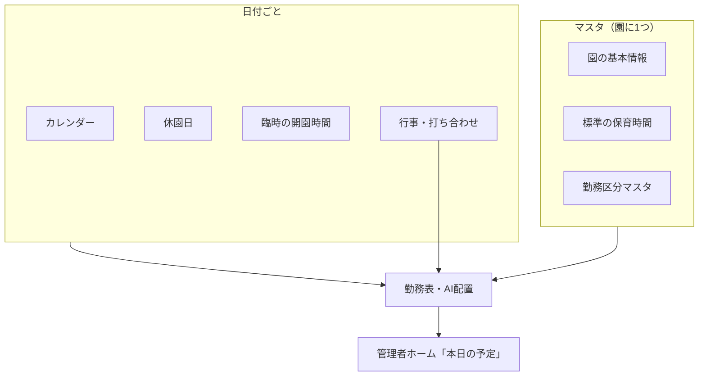
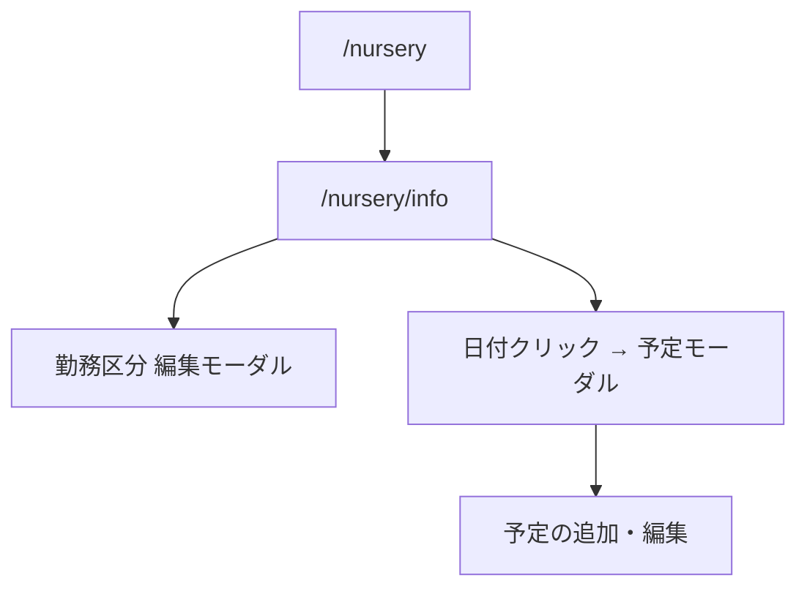

# 園情報・勤務区分（旧） 詳細設計

## 注記

このドキュメントは、画面を `/nursery/settings`（基本情報・保育時間・勤務区分）と `/nursery/calendar`（行事カレンダー）に分離したため、**旧版**です。


## 概要

このドキュメントは、園管理配下の **園情報・勤務区分**（`/nursery/info`）の詳細設計です。

園の**標準の開園時間**、**勤務区分（早番・日勤・遅番など）**、および**カレンダー上の予定**（休園・行事など）を管理します。  

**カレンダーは MVP 必須**です。行事・休園・臨時の開園時間は、月単位の**勤務表全体を組み立てる前提データ**であり、ホーム表示用の付加機能ではありません。  
勤務表作成・AI配置・管理者ホームの「本日の予定」は、ここで登録したデータを参照します。

園管理ハブの概要は [management.md](./management.md) を参照。

## 画面情報

| 項目 | 内容 |
| --- | --- |
| 画面名 | 園情報・勤務区分 |
| パス | `/nursery/info` |
| 親画面 | 園管理ハブ `/nursery` |
| 対象役割 | 管理者（編集）。勤務表作成者（閲覧のみ・将来） |
| 実装ファイル（予定） | `src/app/nursery/info/page.tsx` |
| 関連コンポーネント（予定） | `src/components/nursery-info/*` |
| レイアウト | 本画面は**一覧テーブル型ではない**（[list-screen-layout.md](./list-screen-layout.md) は使わない） |

## 目的

- 園の**いつからいつまで開いているか**（通常保育・延長保育）を明確にする。
- 勤務表で使う**勤務区分**とその**開始・終了時刻**を園ごとに定義する。
- **カレンダー**で、休園日・行事・臨時の時間変更など「日ごとの例外・予定」を登録し、**勤務表作成の入力**とする。
- 行事（体育、避難訓練、療育など）に合わせて、その日・その時間帯に必要な人員配置を考えられるようにする。
- 職員の「働ける時間」（[staff-management.md](./staff-management.md)）や、勤務表の割当の**上限・検証の基準**を揃える。

## 結論（おすすめ）

| 領域 | 方針 |
| --- | --- |
| 開園時間 | **標準は1セット**（開園・閉園・延長終了）。曜日ごとの違いは MVP では持たず、**カレンダーで例外日**を表現する。 |
| 勤務区分 | 園ごとの**マスタ一覧**（早番・日勤・遅番・延長など）。各区分に**開始・終了時刻**を持つ。 |
| カレンダー | **MVP 必須**。毎日のルーティン（開園・給食など）は登録しない。**休園・行事・臨時の開園時間**を載せ、勤務表・AIが日別に参照する。 |
| 画面構成 | 1画面・**縦スクロールのセクション型**（タブまたはアンカー見出し）。保存はセクション単位でも全体でも可（MVP は「変更を保存」1本でも可）。 |



## スコープ

### 含む（MVP）

**4セクションとも初回リリースに含める**（カレンダーは後回しにしない）。

1. **園の基本情報** — 園名、所在地、電話番号
2. **標準の保育時間** — 開園・閉園・延長保育の終了時刻
3. **勤務区分マスタ** — 一覧表示、追加・編集・無効化（削除は無効化推奨）
4. **カレンダー（必須）** — 月表示、日付クリックで予定の追加・編集・削除
   - 勤務表作成対象月の**休園・行事・臨時開園**を事前登録できること
   - 登録データは勤務表画面・AI配置から参照できること（モック段階でも同一データ源）
5. **予定の種類** — 休園、行事・打ち合わせ、臨時の開園時間（短縮・延長）
6. 園管理ハブへの戻り導線

### 初期設定での位置づけ

`docs/business-flow.md` の初期設定では、**勤務区分の直後・職員登録の前後**に、対象月のカレンダー登録を行う想定とする。  
「勤務表を作る月」の行事が未登録のままでは、全体の勤務設計ができないため、園情報画面のカレンダーは**初期設定の必須ステップ**とする。

### 含まない（将来）

- 曜日ごとの標準開園時間（月〜金と土など）
- 給食・おやつなど**毎日繰り返す園の流れ**の登録（カレンダーにも載せない）
- 希望休提出期限・通知設定（別セクション「運用設定」として後続でも可）
- 休憩ルールの詳細（勤務表画面側で扱う）
- Google カレンダー連携
- 複数園の一括設定

## 権限

`docs/permission-design.md` に準拠。

| 操作 | 管理者 | 勤務表作成者 | 職員 |
| --- | --- | --- | --- |
| 園情報の閲覧 | yes | view | no |
| 園情報の編集 | edit | no | no |
| 開園時間の編集 | edit | no | no |
| 勤務区分の編集 | edit | no | no |
| カレンダー予定の編集 | edit | no | no |

## 画面構成

### 全体レイアウト

職員・クラス管理とは異なり、**フォーム＋カレンダー中心**の設定画面とする。

```text
AdminShell
└ home-content（縦スクロール可）
   ├ nav.breadcrumb
   ├ AppHeader（タイトル「園情報・勤務区分」）
   └ main.nursery-info-page
      ├ section: 園の基本情報
      ├ section: 標準の保育時間
      ├ section: 勤務区分
      └ section: カレンダー・園の予定
```

- パンくず・AppHeader は固定してもよいが、**中身はページ全体スクロール**でよい（セクションが縦に続く）。
- 各セクションは白カード（`classes-panel` 系）で区切り、見出し＋説明＋フォーム。

### 画面遷移



## セクション1: 園の基本情報

| 項目 | 種別 | 必須 | 備考 |
| --- | --- | --- | --- |
| 園名 | text | yes | ハブ・ヘッダー表示名と同一 |
| 所在地 | text | no | |
| 電話番号 | text | no | 形式チェックは軽め |

保存後、園管理ハブの園名表示と同期する（将来 API 連携時）。

## セクション2: 標準の保育時間

「園は**何時から何時まで**開いているか」を定義する。勤務区分・職員の働ける時間の**検証上限**になる。

| 項目 | 種別 | 必須 | 説明 | 例 |
| --- | --- | --- | --- | --- |
| 開園時間 | time | yes | 通常保育の開始 | 07:00 |
| 閉園時間 | time | yes | 通常保育の終了 | 18:00 |
| 延長保育の終了 | time | no | 延長がある場合のみ。閉園より後 | 19:00 |

### 表示（わかりやすさ）

- 入力の横または下に **1日のタイムライン（簡易バー）** を表示する。
  - 通常保育: 開園〜閉園
  - 延長: 閉園〜延長終了（設定がある場合）
- ラベル例: `07:00 開園 ───────── 18:00 閉園 ── 19:00 延長終了`

### バリデーション

- 閉園 > 開園
- 延長終了を入力した場合: 延長終了 > 閉園

### カレンダーとの関係

- ここは**平日の標準**。
- 特定日だけ短縮・休園・延長なしにする場合は **セクション4のカレンダー** で上書きする。

## セクション3: 勤務区分

勤務表・希望休・エクスポートで使う **shift_type** の定義。  
`docs/data-design.md` の勤務枠 `shift_type`（`early` / `day` / `late` / `extended` / `off`）に対応するが、**表示名と時刻は園ごとにカスタム**できる。

### 一覧（テーブル）

| 列 | 内容 |
| --- | --- |
| 区分名 | 例: 早番、日勤、遅番、延長保育 |
| コード | 内部用（`early` など）。MVP は固定プリセット＋表示名のみ編集可でも可 |
| 開始 | 例: 07:00 |
| 終了 | 例: 15:00 |
| 状態 | 有効 / 無効 |
| 操作 | 編集 |

- ツールバー: 左 `勤務区分：4件`、右 `区分を追加`（MVP はプリセット4件のみ・追加は将来でも可）。
- **休み**は区分マスタに含めず、勤務表上の「休」として扱う（一覧に出さない）。

### 初期プリセット（新規園）

| 区分名 | コード | 開始 | 終了 | 備考 |
| --- | --- | --- | --- | --- |
| 早番 | early | 07:00 | 15:00 | 開園に合わせて調整 |
| 日勤 | day | 09:00 | 17:00 | |
| 遅番 | late | 11:00 | 19:00 | 閉園・延長に合わせて調整 |
| 延長保育 | extended | 18:00 | 19:00 | 延長終了が未設定の園は非表示 or 無効 |

### 編集モーダル

| 項目 | 種別 | 必須 | 備考 |
| --- | --- | --- | --- |
| 区分名 | text | yes | |
| 開始時刻 | time | yes | |
| 終了時刻 | time | yes | 開始より後 |
| 有効 | toggle | yes | 無効化すると新規割当に出さない |

### バリデーション（園の時間との整合）

| 区分 | ルール |
| --- | --- |
| 早番・日勤・遅番 | 開始 ≥ 開園、終了 ≤ 閉園（厳密でなくても警告表示可） |
| 延長保育 | 開始 ≥ 閉園、終了 ≤ 延長終了（延長未設定の園は登録不可） |

職員の「働ける時間」（例: 07:00-19:00）は、この区分のいずれかに**収まるか**で配置可否を判断する（[staff-management.md](./staff-management.md)）。

## セクション4: カレンダー・園の予定

**勤務表全体を組み立てるために必要**なセクション。  
行事の有無・時刻によって、その日の必要人員・時間帯の押さえ方が変わるため、勤務表作成・AI配置の**入力データ**として扱う。  
（管理者ホームの「本日の予定」は、このデータの**当日分の表示**にとどめる。）

### 表示方針（ホーム画面と揃える）

[home-screen-design.md](../home-screen-design.md) の「本日の予定」と同じ思想:

- **載せる**: 休園、短縮保育、行事、打ち合わせ、避難訓練、外来の療育など
- **載せない**: 開園、閉園、給食、おやつなど毎日同じ流れ

### カレンダー UI

| 要素 | 説明 |
| --- | --- |
| 月切り替え | 前月 / 翌月、または月ピッカー |
| 月間グリッド | 日付セル。予定がある日はドットまたは短いラベル（種別色） |
| 凡例 | 休園 / 行事 / 臨時時間 |
| 下段リスト | 当月の予定を日付順（見逃し防止） |

**日付クリック** → その日の予定一覧＋「予定を追加」→ モーダル。

### 予定の種類（event_type）

| 種類 | コード | 勤務表への影響 | ホーム連携 |
| --- | --- | --- | --- |
| 休園 | closure | その日の勤務枠は作らない／既存は警告 | 当日表示（将来） |
| 臨時の開園時間 | special_hours | その日の配置可能時間帯・区分の上限を上書き | — |
| 行事・打ち合わせ | event | **その時間帯の人員・配置の前提**（下表） | 本日の予定に表示 |

### 予定フォーム（モーダル）

共通:

| 項目 | 種別 | 必須 |
| --- | --- | --- |
| 種類 | select | yes |
| 日付 | date | yes |
| タイトル | text | yes（休園は「休園」固定でも可） |
| メモ | textarea | no |

種類ごとの追加項目:

**休園（closure）**

- 終日（日付のみ）

**臨時の開園時間（special_hours）**

| 項目 | 必須 |
| --- | --- |
| 開園 | yes |
| 閉園 | yes |
| 延長終了 | no |

**行事・打ち合わせ（event）**

| 項目 | 必須 |
| --- | --- |
| 開始時刻 | yes |
| 終了時刻 | no |

例: `9:30 わくわく体育`（ホームのダミーと同形式）

### バリデーション

- 同一日・同一種類で重複する休園は不可
- special_hours: 閉園 > 開園
- event: 開始時刻はその日の開園〜閉園（または special_hours があればその範囲）内を推奨（警告）

### カレンダーと勤務表作成の関係（必須）

勤務表作成画面（将来）は、対象月の `nursery_calendar_entry` を**最初に読み込む**。

| 予定 | 勤務表作成での扱い（方針） |
| --- | --- |
| 休園 | その日は割当対象外。AI・手動ともに枠を作らない |
| 臨時開園 | その日だけ `open_time` / `close_time` / `extended_close_time` を上書きし、区分・配置の検証に使う |
| 行事 | 日別勤務表・月間一覧に**行事バッジ／時刻帯**を表示。配置時に「この時間は体育対応」などを判断できるようにする |

行事の例と配置への示唆（MVP は表示・参照まで。自動配置ルールは AI 設計側で拡張）:

| 行事例 | 配置への示唆 |
| --- | --- |
| わくわく体育 | 指定時刻前後はクラスから人員を外す／会場対応者を確保 |
| 避難訓練 | 全園関係者の一斉参加。通常クラス配置と競合 |
| 誕生日会打ち合わせ | 管理者・担当者の短時間離席 |
| 外来療育 | 特定児・担当職員の時間ブロック |

**運用**: 勤務表を作る**前に**、対象月のカレンダーを埋める。未登録の行事がある日は、勤務表画面で「カレンダー未登録」警告を出してもよい（将来）。

### 勤務表・AIとの参照（技術方針）

- モック: `mock-calendar-events.ts` を園情報画面・勤務表画面・ホームで**共有**
- API 化後: `GET /nurseries/:id/calendar?month=YYYY-MM` を勤務表作成の前提 API とする

## データ設計（追加分）

`docs/data-design.md` に未記載のため、本画面用の概念モデルを定義する。DB 化時にテーブル化する。

### 園（既存の拡張）

既存の `open_time` / `close_time` / `extended_close_time` をそのまま使用。

### 勤務区分マスタ（新規）

`shift_type_definition`

| 項目 | 型 | 必須 | 説明 |
| --- | --- | --- | --- |
| id | string | yes | |
| nursery_id | string | yes | |
| code | enum | yes | `early`, `day`, `late`, `extended` |
| name | string | yes | 表示名（早番など） |
| start_time | time | yes | |
| end_time | time | yes | |
| sort_order | number | yes | 一覧順 |
| is_active | boolean | yes | |
| created_at / updated_at | datetime | yes | |

### 園カレンダー予定（`calendar_entry`）

休日設定の休園と行事カレンダーを**同一テーブル**で保持。`nursery_closed_day` は使わない。  
詳細: [holiday-and-calendar-data.md](./holiday-and-calendar-data.md) / [data-design.md](../../data-design.md)

定休曜日は `nursery.weekly_closed_weekdays`（`nursery` テーブルの列）。

## MVP 実装方針

**カレンダーは省略不可**。UI 実装の作業順は分けてもよいが、MVP として `/nursery/info` を公開するときは **4セクションすべて**を含める。

| 作業順（開発用） | 内容 |
| --- | --- |
| 1 | 基本情報・保育時間・勤務区分＋モック永続（local state） |
| 2 | カレンダー CRUD（3種類すべて）＋ `mock-calendar-events` |
| 3 | ホーム「本日の予定」とデータ共有 |
| 4 | 勤務表画面（未実装でも）からカレンダー参照の型・モック API を用意 |

初期設定フロー（[business-flow.md](../../business-flow.md)）は、開園時間・勤務区分に続き**対象月カレンダー登録**を必須ステップとする。

## 関連画面との役割分担

| 画面 | 役割 |
| --- | --- |
| **園情報・勤務区分**（本画面） | 標準時間・区分マスタ・**月間カレンダー（入力）** |
| 職員管理 | 個人の「働ける時間」、担任 |
| クラス管理 | クラス・園児数 |
| 勤務表作成 | 月単位の割当。**カレンダーを読んで**日別・全体の勤務を組み立てる |
| 管理者ホーム | カレンダーの**当日分を表示**するだけ（編集は本画面） |

## ワイヤ（ASCII）

```text
┌─────────────────────────────────────────────────────────┐
│ 園管理 > 園情報・勤務区分                                │
│ 園情報・勤務区分                                         │
│ 開園時間・勤務区分・園の予定を設定します。                │
├─────────────────────────────────────────────────────────┤
│ 【園の基本情報】                          [変更を保存]   │
│  園名 [星の子保育園    ]  所在地 [          ]           │
│  電話 [03-xxxx-xxxx   ]                                 │
├─────────────────────────────────────────────────────────┤
│ 【標準の保育時間】                        [変更を保存]   │
│  開園 [07:00]  閉園 [18:00]  延長終了 [19:00]           │
│  ●━━━━━━━通常━━━━━━━●━━延長━━●  （タイムラインバー）    │
├─────────────────────────────────────────────────────────┤
│ 【勤務区分】                              [区分を追加]   │
│  早番   07:00-15:00  有効  [編集]                       │
│  日勤   09:00-17:00  有効  [編集]                       │
│  遅番   11:00-19:00  有効  [編集]                       │
│  延長   18:00-19:00  有効  [編集]                       │
├─────────────────────────────────────────────────────────┤
│ 【カレンダー・園の予定】          ◀ 2026年5月 ▶          │
│  日 月 火 水 木 金 土                                    │
│        ·1  2  3  4  5  …  （·=予定あり）                │
│  …                                                      │
│  5/27(火) 9:30 わくわく体育  [編集]                     │
│  5/30(金) 休園              [編集]                      │
│                              [予定を追加]               │
└─────────────────────────────────────────────────────────┘
```

## 関連ドキュメント

- [management.md](./management.md) — 園管理全体・初期設定順
- [list-screen-layout.md](./list-screen-layout.md) — 一覧画面用（本画面は対象外）
- [staff-management.md](./staff-management.md) — 職員の働ける時間
- [home-screen-design.md](../home-screen-design.md) — 本日の予定の表示方針
- [business-flow.md](../../business-flow.md) — 初期設定フロー
- [data-design.md](../../data-design.md) — 園テーブル
- [ai-shift-generation-design.md](../../ai-shift-generation-design.md) — AI が参照する開園・区分

## 関連コンポーネント・ファイル（予定）

| 種別 | パス |
| --- | --- |
| ページ | `src/app/nursery/info/page.tsx` |
| 設定 UI | `src/components/nursery-info/nursery-info-settings.tsx` |
| 保育時間 | `src/components/nursery-info/nursery-hours-section.tsx` |
| 勤務区分 | `src/components/nursery-info/shift-types-section.tsx` |
| カレンダー | `src/components/nursery-info/nursery-calendar-section.tsx` |
| モック | `src/lib/mock-nursery-info.ts`, `src/lib/mock-calendar-events.ts`（ホームと共有可） |
