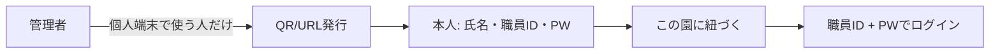
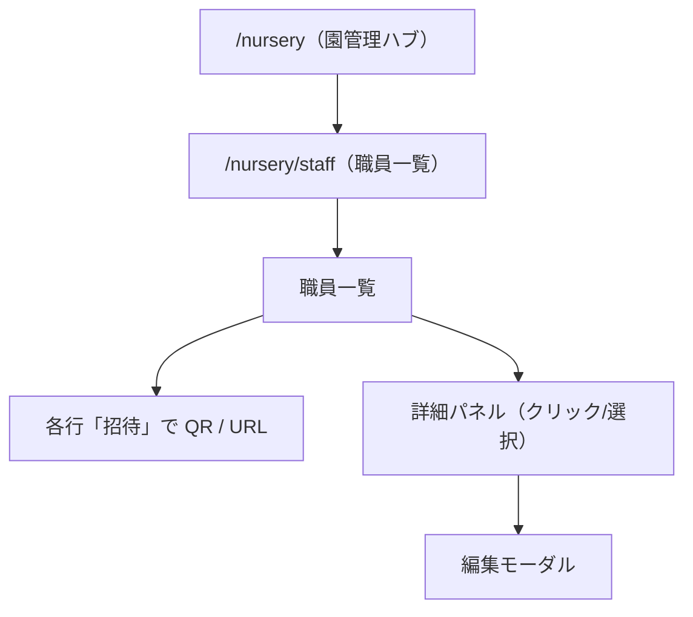

# 職員管理 詳細設計

## 概要
このドキュメントは、園管理配下の**職員管理**（職員一覧・登録/編集・無効化）と、一覧に統合した**招待**（QR / 招待URL）の詳細設計をまとめます。

`docs/details/nursery/management.md` に示すとおり、MVPでは実データ連携はプレースホルダー実装を前提とします。

## 画面情報

| 項目 | 内容 |
| --- | --- |
| 画面名 | 職員管理 |
| 親画面 | 園管理ハブ `/nursery` |
| 子画面 | `/nursery/staff` |
| 旧URL | `/nursery/staff/invitations` → `/nursery/staff` へリダイレクト |
| 実装ファイル | `src/app/nursery/staff/page.tsx`（パンくず・AppHeader） |
| 関連コンポーネント | `src/components/staff/*` |
| レイアウト | [list-screen-layout.md](./list-screen-layout.md) |

## 目的
- 園に所属する職員の情報（雇用区分・職種・資格・**働ける時間**など）を一元管理する。
- 職員が担任（担当可能クラス）を設定できるようにする（例: 「0歳児担任」）。
- 園管理者が職員へアカウント招待（QR / URL）を発行・管理できるようにする。

## 結論（おすすめ）
- 主導線は **職員新規登録**（マスタ登録）→ 必要な人だけ **招待**（個人端末用）。
- **ログインはメール不要**。職員は **職員ID + パスワード** のみ（園コード入力も不要）。
- **QR / 招待URL は「自分の端末で使う職員」向け**。QR に園の紐づけ情報を含め、読み取った端末から**この園用**のアカウントを初回登録する。
- 園の共有端末だけで見る職員は、個人QR・個人アカウントを**必須にしない**（後述）。
- 招待方法（個人端末向け）は2本立て。
  - **QR印刷**（現場配布向け・主）
  - **招待URL共有**（LINE など。メール送信機能は持たない）
- 初回登録は職員本人が実施（氏名・**職員ID**・パスワード・必要なら雇用区分など）。
- 管理者は事前に職員を選ばない。QR/URL を渡して「こちらから登録してください」と案内する。

### アカウントの考え方（2パターン）

| パターン | 誰向け | 初回登録（QR） | 日常の利用 |
| --- | --- | --- | --- |
| **個人端末あり** | 自宅のスマホでも使う職員 | スマホで QR を読んで登録 | **どの端末でも** 職員ID + パスワード |
| **園の共有端末中心** | 園のタブレット/PC だけで十分な職員 | QR を**配らなくてよい**（園タブレットで初回登録を手伝う、または管理者が代行登録） | **園タブレットから** 職員ID + パスワード |

「他のデバイスで使う人だけ、個人用に QR を配る」という意味。  
**登録後は端末を問わない** — 希望休の入力・勤務表の確認・パスワード変更などは、**園のタブレットから同じ職員IDでログインして行える**。

### 共有タブレットからの変更（よくある質問）
- **はい、園のタブレットから変更できる。**
- ログインは常に **職員ID + パスワード**（端末が変わっても同じ）。
- QR は「初めてこの園のアカウントを作るとき」に使う。すでに登録済みなら、タブレットのログイン画面だけでよい。
- 自宅のスマホで登録した職員も、園に来たときはタブレットから同じ ID でログインして操作できる（逆も同様）。

### 職員ID（ログインID）
- **1からの数字**（例: 入力は `1` でも可）。保存・一覧表示は6桁（`000001`）。一覧は職員IDの昇順。メールアドレスは使わない。
- **初回登録時に本人が決める**（園内で重複不可）。
- 忘れた場合は管理者が再設定・再招待（将来）。

### 現場向けの運用（高齢の職員を含む・個人端末）
1. 管理者が職員を登録し、一覧の「招待」→ **QR印刷**を選んで用紙を渡す。
2. 職員がスマホで QR を読み取り、**氏名・職員ID・パスワード**を入力して登録完了（この時点で**この園**に紐づく）。
3. 以降、ログイン画面では **職員ID + パスワード** のみ。
4. 管理者の一覧に職員が現れる。

URL 共有は LINE 等に慣れた職員向け。QR は口頭説明が少なく、おばあちゃん先生にも渡しやすい。

## スコープ

### 含む（MVP）
- 職員一覧（検索・一覧表示）
- 職員の**新規登録**（管理者が職員マスタを登録）
- 一覧各行の**招待**（個人端末用 QR / URL の発行）
- 職員編集（詳細パネルからモーダル）
- 職員詳細パネル（一覧から遷移）
- 無効化/削除（MVPは削除より無効化推奨）
- 招待（一覧各行のモーダルで QR / URL 発行。未登録時は行に「招待中」表示）

### 含まない（将来/別画面）
- 勤務表の確定・公開
- 体制表作成画面での自動配置・チェックロジック（必要なデータだけ持つ）
- CSV インポート/エクスポート（将来）

## 権限
`docs/permission-design.md` に準拠。

| 操作 | 管理者 | 勤務表作成者 | 職員 |
| --- | --- | --- | --- |
| 職員一覧の閲覧 | yes | no | no |
| 職員登録・編集 | edit | no | no |
| 職員の無効化/削除 | edit | no | no |
| 招待の発行（一覧各行） | edit | no | no |

## 画面構成

## 職員一覧（`/nursery/staff`）

レイアウト（パンくず / AppHeader / 一覧パネル分割・一覧のみスクロール）は **[list-screen-layout.md](./list-screen-layout.md)** を参照。

### 一覧テーブル
一覧はテーブルで表示します。並び順は職員ID昇順（`000001` から）。

### 一覧パネル上部
| 位置 | 内容 |
| --- | --- |
| 左 | **職員数：○名** |
| 右 | **職員新規登録** ボタン |
| その下 | 氏名・職員IDで検索 |

招待状況の一覧テーブルは持たない（各行の「招待」「招待中」で足りる）。

| 列 | 内容 |
| --- | --- |
| 職員ID | `Staff.staff_id`（ログイン用・一覧の左端） |
| 氏名 | `Staff.name` |
| 職種 | `Staff.job_type` |
| 雇用区分 | `Staff.employment_type` |
| 資格 | 保育士資格など（例: `has_nursery_teacher_license`） |
| 担任（担当可能クラス） | `staff_class_capability` のラベル |
| 働ける時間 | 勤務可能な時間帯（例: `07:00-19:00`＝この範囲で早番〜遅番に配置可） |
| 招待 | 個人端末用 QR / URL 発行（発行済みは「招待中」） |

### 詳細パネル（一覧から）
クラス管理同様に、一覧から開く詳細パネルを想定します。

| セクション | 表示内容 |
| --- | --- |
| ヘッダー | 氏名 + （職種/資格）タグ |
| 基本情報 | 職員ID / 電話 / ふりがな（入力がある場合） |
| 資格 | 保育士資格の有無（必要なら他資格の将来枠） |
| 働ける時間 | 登録した時間帯（例: 07:00-19:00） |
| 担任（担当可能クラス） | 「0歳児担任」「1歳児担任」などのラベルをタグ一覧で表示 |
| 操作 | 「編集する」/（無効化） |

### 新規登録・編集モーダル
- **職員新規登録**ボタン: 管理者が職員マスタ（氏名・雇用区分など）を登録する。
- **編集**: 詳細パネルから。保存後は一覧に戻る。
- **招待**: 一覧の各行「招待」から、個人端末用 QR / URL を発行（職員マスタ登録済みが前提）。

#### フォーム項目
| 項目 | 種別 | 必須 | 備考 |
| --- | --- | --- | --- |
| 職員ID | text | no | ログイン用（1〜999999・園内一意）。招待で本人設定する場合は空欄可 |
| 氏名 | text | yes | 1文字以上 |
| ふりがな | text | no | 入力があれば表示 |
| 電話番号 | text | no | 形式チェックは軽め（将来強化） |
| 雇用区分 | select | yes | `seikin / jokin / hijokin`（表示: 正勤 / 常勤 / 非常勤） |
| 職種 | select | yes | `nursery_teacher / nurse / cook / office / other` |
| 保育士資格 | checkbox | yes | `has_nursery_teacher_license` |
| 働ける時間 | 時刻範囲 | no | **開始〜終了**（例: 07:00-19:00）。この帯内なら早番・遅番などに配置可能 |
| 担任（担当可能クラス） | checkbox | no | 「0歳児担任」「1歳児担任」…の形で選択 |
| 担当クラス備考 | per-class note | no | （将来拡張でも良い） |

#### バリデーション（MVP）
- 氏名が空の場合はエラー
- 雇用区分・職種が未選択の場合はエラー
- 働ける時間を入力する場合は、開始・終了とも必須（終了は開始より後）

#### 保存時の挙動
- バリデーション通過後、一覧データを更新
- モーダルを閉じて一覧へ復帰

## 招待（職員一覧に統合）

### 目的
- **自分の端末で使う職員**向けに、園に紐づく初回登録用の QR / URL を発行する。
- 職員一覧の各行「招待」から発行する。
- 当初は別画面「招待管理」タブの依頼があったが、運用は一覧にまとめた。旧 `/nursery/staff/invitations` は職員一覧へリダイレクト。

### 招待発行モーダル（一覧の「招待」から）
対象職員は行で固定（職員マスタ登録済みが前提）。

| 項目 | 種別 | 必須 | 説明 |
| --- | --- | --- | --- |
| 対象 | 表示 | — | 招待する職員名 |
| 招待方法 | radio | yes | QR印刷（現場配布） / 招待URL（LINE 等） |
| 有効期限 | select | yes | 例: 24時間 / 72時間 / 7日間 |
| 送信/表示 | button | yes | URLコピーまたはQR表示/印刷 |

### 招待の制約（実装方針）
`docs/details/login-screen-design.md` に準拠し、少なくとも以下を前提に設計します。
- 招待URLには有効期限
- 招待URLは原則1回のみ利用
- 招待URLには推測しにくいトークンを使用
- パスワード設定後に無効化
- ステータスは `未使用 / 使用済み / 期限切れ / 無効` で管理する

### 仮パスワード方式（補足）
- 第一候補は**ワンタイム招待URL（有効期限付き）**とする。
- 仮パスワードを運用する場合は以下を必須とする。
  - 初回ログイン時に必ず変更
  - 有効期限を短く設定（例: 24時間）
  - 失敗回数制限
  - 紙/口頭配布ルールの明確化

## データ項目対応（設計の前提）

### 職員（MVP クライアントモデル）
| 項目 | 説明 |
| --- | --- |
| `staff_id` | ログイン用職員ID（6桁数字・園内一意） |
| `work_availability` | 働ける時間帯 `{ start, end }`（例: 07:00-19:00）。早番・遅番の可否ではなく**帯の時間** |
| `capable_class_ids` | 担任（担当可能クラス） |

`docs/data-design.md` の職員テーブルは旧項目（`can_work_early_shift` 等）を含む。本番DB化時は `work_availability_start` / `work_availability_end` 等に整理する。

### その他
- 職員担当可能クラス（`職員担当可能クラス` テーブル）
- 招待: 将来 `invitation` / `invitation_token` テーブル

