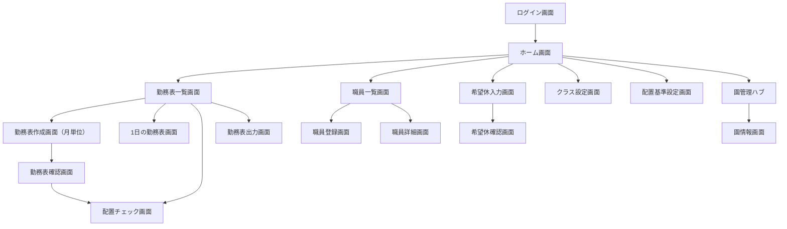

# 画面構成

## 概要

このドキュメントは、保育園向け勤務表管理システムの初期画面構成案をまとめたものです。
実装の進行に合わせて、画面名・機能・導線を更新してください。

## 画面一覧

| 画面名 | パス例 | 主な役割 |
| --- | --- | --- |
| ログイン画面 | `/login` | ユーザー認証を行う |
| ホーム画面 | `/home` | 役割ごとのダッシュボード。管理者は本日の予定と主要機能への導線を表示する |
| 職員一覧画面 | `/staff` | 保育士、看護師、調理員、事務などの職員を一覧で確認する |
| 職員登録画面 | `/staff/new` | 職員の基本情報、資格、担当可能クラスを登録する |
| 職員詳細画面 | `/staff/:id` | 個別職員の情報や勤務履歴を確認する |
| 希望休入力画面 | `/staff/requests` | 職員本人が休みたい日や勤務希望を入力する |
| 希望休確認画面 | `/staff/requests/confirm` | 入力した休み希望や勤務希望を保存前に確認する |
| クラス設定画面 | `/nursery/classes` | クラスの一覧表示、登録、編集、削除（園管理配下） |
| クラス設定画面（旧） | `/classes` | ※ `/nursery/classes` に統合 |
| 配置基準設定画面 | `/staffing-rules` | 年齢別の必要保育士数や園独自ルールを設定する |
| 勤務表一覧画面 | `/shifts` | 作成済みの勤務表を一覧で確認する |
| 勤務表作成画面（月単位） | `/shifts/monthly/new` | AIが1か月分の勤務表のたたき台を作成し、人が修正する |
| 勤務表確認画面 | `/shifts/monthly/confirm` | AI作成案と修正後の勤務表を確定前に確認する |
| 1日の勤務表画面 | `/shifts/daily` | 指定した1日のクラス別・時間帯別の職員配置を確認する |
| 配置チェック画面 | `/shifts/check` | 園児数に対して必要な職員数を満たしているか確認する |
| 勤務表出力画面 | `/shifts/export` | 勤務表の CSV 出力、印刷用表示を行う |
| 園管理ハブ | `/nursery` | 園情報、クラス、配置基準、職員、招待への導線 |
| 園情報・勤務区分 | `/nursery/info` | 園情報、開園時間、勤務区分、希望休提出期限などを管理する |
| 設定画面（旧） | `/settings` | ※ `/nursery/info` に統合。ドキュメント上の参照用 |

## 画面遷移

## 共通レイアウト

現在の UI 実装（ホーム画面）では、以下の共通レイアウトを採用する。

- 左サイドバー: ブランド名、折りたたみトグル、役割別メニュー、ユーザー情報、ログアウト
- メインエリア: 画面上部に役割・日付などのヘッダー、下部に画面固有のコンテンツ
- フッター: 現時点では未実装

詳細は `docs/details/home-screen-design.md` を参照する。

### サイドバー（管理者・現在実装）

| メニュー | 説明 |
| --- | --- |
| ホーム | ホーム画面 |
| 勤務表作成 | 勤務表の作成・確定（未接続） |
| 体制表作成 | クラス別・時間帯別の職員配置（未接続） |
| 園管理 | 園管理ハブへ遷移（`/nursery`） |

サイドバー下部には、役割名・表示名・メールアドレスと、ログアウト（`/login` へ遷移）を配置する。

### サイドバー（将来の全体像）

管理者向けには、園設定・配置基準・招待管理などの画面も今後追加する。勤務表作成者・職員向けメニューは役割ごとに別構成とする（`permission-design.md` 参照）。

## 各画面の主な要素

### ログイン画面

- メールアドレス入力
- パスワード入力
- ログインボタン
- 認証エラー表示

### ホーム画面

#### 管理者（現在の UI 実装）

- 本日の予定: 開園・給食などの通常フローではなく、行事・イベントなど**特別な予定のみ**を時刻順に表示する。件数が多い場合は縦スクロールする。
- 機能カード（3枚）: 勤務表作成、体制表作成、園管理への導線
- ヘッダー右上: 役割名（例: 管理者）

#### 管理者（将来拡張）

- 本日の職員配置概要
- クラス別の必要職員数と配置状況
- 未確定の勤務表件数
- 未提出の希望休件数
- 配置基準を満たしていない日のアラート
- お知らせ

#### 勤務表作成者・職員（仮実装）

現時点ではタイトル・説明文と機能カードのみのプレースホルダー表示。管理者ホームの UI をベースに、役割ごとの内容へ順次差し替える。

### 勤務表一覧画面

- 年月、ステータスによる絞り込み
- 作成済み勤務表の一覧
- 勤務表作成ボタン
- 1日の勤務表、出力画面への導線

### 勤務表作成画面（月単位）

- 対象年月
- 職員一覧
- 希望休入力画面で登録された休み希望、勤務希望
- 職員の資格、勤務可能時間、担当可能クラス
- クラス情報、園児数、配置基準
- AIによる勤務表のたたき台作成
- AI作成時に重視する条件の指定
- クラス別、時間帯別の勤務割り当て
- 早番、日勤、遅番、延長保育などの勤務区分
- 保育士、看護師、調理員、事務などの職種
- AI作成案に対する人の確認、修正
- 園児数に対する配置基準チェック
- 確認画面への導線

### 勤務表確認画面

- AIが作成した勤務表のたたき台
- 人が修正した内容
- 希望休との矛盾チェック
- 配置基準チェック結果
- 職員ごとの勤務日数、早番、遅番の偏り確認
- 修正画面へ戻る導線
- 勤務表の確定操作

### 1日の勤務表画面

- 勤務日
- クラス別の園児数
- クラス別、時間帯別の必要職員数
- その日に勤務する職員一覧
- 各職員の開始時刻、終了時刻、休憩時間
- 担当クラス、担当ポジション
- 早番、遅番、延長保育の担当
- 日別メモ

### 配置チェック画面

- 対象年月または対象日
- 年齢別、クラス別の園児数
- 配置基準上の必要職員数
- 実際に配置されている職員数
- 不足している日、時間帯、クラスの一覧
- 保育士資格者が必要人数を満たしているかの確認
- AI作成案で調整が必要な箇所の表示
- 修正が必要な勤務表への導線

### 勤務表出力画面

- 対象年月または対象日
- CSV インポート
- CSV エクスポート
- 印刷用レイアウト表示
- 紙で出すための印刷ボタン
- 印刷前の表示確認
- 職員向け、管理者向け、掲示用などの出力形式

### 職員一覧・詳細画面

- 職員一覧テーブル
- 氏名、連絡先、雇用区分
- 職種
- 保育士資格などの資格情報
- 担当可能クラス
- 勤務可能曜日、時間帯
- 勤務履歴

### 職員登録画面

- 氏名
- 連絡先
- 雇用区分
- 職種
- 資格情報
- 担当可能クラス
- 勤務可能曜日、時間帯
- 早番、遅番、延長保育の対応可否
- 登録内容確認への導線

### 希望休入力画面

- 対象年月
- 休みたい日
- 勤務できる日、勤務できる時間帯
- 早番、遅番などの勤務希望
- 延長保育に入れる日
- 希望理由やメモ
- 入力内容確認への導線

### 希望休確認画面

- 入力した休み希望の一覧
- 入力した勤務希望の一覧
- メモ内容
- 修正、送信操作

### クラス設定画面

- クラス一覧テーブル
- クラス追加ボタン
- 登録・編集モーダル（クラス名、年齢区分、園児数、主担当職員、補足メモ）
- 削除確認ダイアログ

詳細は `docs/details/nursery/classes.md` を参照。

### 配置基準設定画面

- 年齢区分ごとの園児数と保育士数の基準
- 保育士資格者としてカウントする職種
- 早番、遅番、延長保育の最低配置人数
- 園独自の追加ルール
- 基準変更時の確認

### 設定画面

- 園名、所在地などの園情報
- 開園時間、閉園時間
- 延長保育時間
- 勤務時間の基本設定
- 早番、日勤、遅番などの勤務区分
- 休憩ルール
- 通知設定

## 今後検討する項目

- 権限ごとの表示制御
- スマートフォン向けレイアウト
- 希望休の提出期限
- 勤務表の承認フロー
- AIが勤務表を作成する際の優先条件
- AI作成案を人が修正した履歴の管理
- CSV インポート、エクスポートの項目定義
- 紙で印刷する勤務表のレイアウト
- 通知方法と通知タイミング

## 次に作成すべき設計

画面構成とデータ設計の次は、AI勤務表作成ロジック設計を作成する。
このシステムの中心機能は、職員情報、希望休、クラス、園児数、配置基準をもとに、AIが日々の勤務表のたたき台を作り、人が確認して修正できることにある。

作成候補は以下の順番がよい。

1. AI勤務表作成ロジック設計: AIに渡す情報、優先条件、制約、出力形式、人が修正する流れを定義する。
2. 業務フロー設計: 希望休提出からAI作成、配置チェック、修正、確定、印刷までの流れを整理する。
3. 権限設計: 管理者、勤務表作成者、職員ができる操作を整理する。
4. 印刷・CSV設計: 紙で出す勤務表のレイアウトと、CSV の項目を定義する。
5. 画面詳細設計: 各画面の入力項目、ボタン、バリデーション、エラー表示を定義する。

### 作成済みの画面詳細設計

- ログイン画面: `docs/details/login-screen-design.md`
- ホーム画面（管理者 TOP）: `docs/details/home-screen-design.md`
- 園管理: `docs/details/nursery/`（[一覧](./details/nursery/README.md)）
- 園管理ハブ: `docs/details/nursery/management.md`
- クラス設定: `docs/details/nursery/classes.md`
